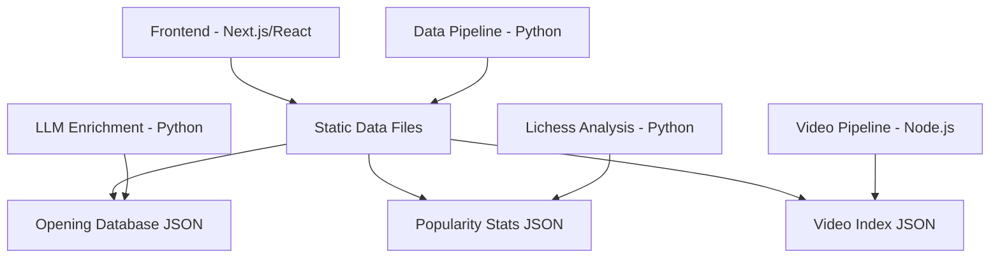

# Chess Opening Explorer - Project Overview

## Project Purpose

The Chess Opening Explorer is a comprehensive web application that helps chess players explore, learn, and analyze chess openings. It combines rich opening data, popularity statistics from Lichess, LLM-generated educational content, and curated YouTube videos to provide an immersive learning experience.

## Core Features

### 1. Opening Database

- Comprehensive database of chess openings with ECO codes
- Hierarchical structure showing opening variations and lines
- Move sequences in PGN format
- Opening names and alternative names

### 2. Popularity Statistics

- Real-time popularity data from Lichess master games
- Win/draw/loss statistics for each opening
- Trend analysis over time
- Filtered by player rating levels

### 3. LLM-Enriched Content

- AI-generated opening descriptions and strategic insights
- Key ideas and typical plans for each opening
- Common tactical themes and patterns
- Historical context and famous games

### 4. Video Integration

- Curated YouTube videos matched to specific openings
- Automated video discovery pipeline
- Quality scoring and relevance matching
- Embedded video player integration

## Architecture Overview



## Technology Stack

### Frontend

- **Framework**: Next.js (React)
- **Styling**: CSS Modules
- **Deployment**: Vercel
- **Data**: Static JSON files (pre-generated)

### Backend/Pipelines

- **Python**: Data analysis, LLM enrichment, Lichess integration
- **Node.js**: Video discovery and matching pipeline
- **Data Storage**: JSON files in `/data` directory

### External Services

- **Lichess API**: Game statistics and popularity data
- **YouTube API**: Video discovery and metadata
- **Google Gemini**: LLM content generation

## Key Domain Concepts

### ECO Codes

- **E**ncyclopedia of **C**hess **O**penings classification system
- Format: Letter (A-E) + two digits (00-99)
- Example: E60 = King's Indian Defense
- Hierarchical: E60 → E61 → E62 (increasing specificity)

### Opening Hierarchy

```
Opening Family (e.g., "Sicilian Defense")
  └─ Opening Variation (e.g., "Najdorf Variation")
      └─ Opening Line (e.g., "English Attack")
```

### PGN (Portable Game Notation)

- Standard format for chess moves
- Example: `1. e4 c5 2. Nf3 d6 3. d4 cxd4`
- Used to represent opening move sequences

## Data Flow

### 1. Opening Data Enrichment

```
Base Opening Data → LLM Enrichment → Enhanced JSON → Frontend
```

### 2. Popularity Statistics

```
Lichess API → Python Analysis → Aggregated Stats → Frontend
```

### 3. Video Pipeline

```
YouTube Search → Video Discovery → Matching Algorithm → Video Index → Frontend
```

## Project Structure

```
chess-opening-explorer/
├── .github/
│   ├── instructions/       # AI assistant guidelines
│   └── memory-bank/        # Project context and tasks
├── data/                   # Static data files
│   ├── openings.json       # Opening database
│   ├── popularity-stats.json
│   └── video-index.json
├── pages/                  # Next.js pages
├── components/             # React components
├── scripts/                # Build and utility scripts
├── tools/
│   ├── analysis/           # Python analysis tools
│   └── video-pipeline/     # Video discovery tools
└── workflows/              # Custom workflows

## Workflows

The project uses custom workflows (in `.agent/workflows/`) for common tasks:

- `/enrich-openings` - Run LLM enrichment for opening descriptions
- `/update-popularity-stats` - Fetch and update Lichess statistics
- `/video-pipeline` - Discover and match YouTube videos

## Key Design Decisions

### Static Site Generation
- All data pre-generated at build time
- No runtime database or API calls
- Fast page loads, excellent SEO
- Simple deployment (Vercel)

### JSON Data Storage
- Human-readable and version-controllable
- Easy to inspect and debug
- No database infrastructure needed
- Simple backup and recovery

### Separate Pipelines
- Each data source has dedicated pipeline
- Can run independently
- Clear separation of concerns
- Easy to maintain and extend

### LLM Integration
- Gemini API for content generation
- Batch processing with rate limiting
- State persistence for resumable runs
- Quality validation before committing

## Common Patterns

### Data Pipeline Pattern
1. Fetch/generate raw data
2. Transform and validate
3. Merge with existing data
4. Write to JSON files
5. Commit to version control

### Error Handling
- Graceful degradation (missing data doesn't break UI)
- Comprehensive logging in pipelines
- State persistence for long-running jobs
- Retry logic for API calls

### Performance Optimization
- Lazy loading for large lists
- Image optimization
- Code splitting
- Static generation for speed

## Development Workflow

1. **Local Development**: `npm run dev`
2. **Data Updates**: Run appropriate workflow
3. **Testing**: Manual testing + automated checks
4. **Deployment**: Push to main → Vercel auto-deploys

## Known Constraints

- **Lichess API**: Rate limited, requires respectful usage
- **YouTube API**: Daily quota limits
- **Gemini API**: Token limits and costs
- **Build Time**: Large data files can slow builds
- **Static Data**: Updates require rebuild/redeploy
```
